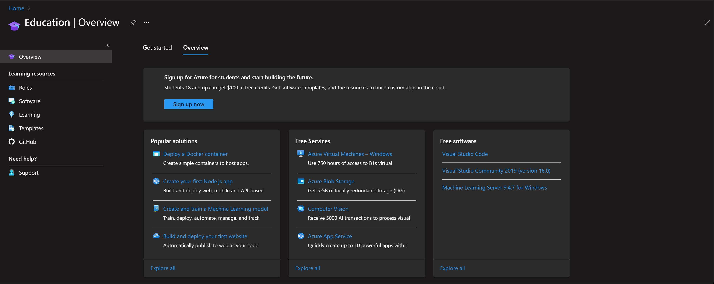
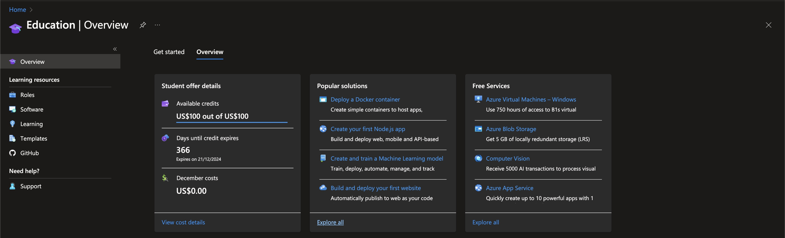

# Setting up Development Environment and Tools
This Document sets up everything to be ready to go for the course Industrial IoT for Digitization of Electronic Assets. Not everything described here is strictly necessary and you are free to use alternatives, however with this setup we can provide the best support and with alternatives you have to figure most parts out on your own.

## Development Environment

### Installing WSL2 (only needed if you are using Windows)
Follow this tutorial to install Windows Subsystem for Linux 2 (WSL2):

https://learn.microsoft.com/en-us/windows/wsl/install

Make sure to set the version of WSL to 2 and choose Ubuntu as Linux Distribution.

Open the Distribution installed in WSL2. Setup a username and password.
You are then greeted by a bash linux environment which is a fully virtualized Linux setup. It enables you to do anything like you are an a native linux install. Further does it have integrations with windows to make working with both systems at the same time easier.
In the windows explorer you can find a linux folder where you have access to the linux filesystem. The other direction you can access the windows filesystem from linux under the `/mnt/c/` folder.
This enables you easily to copy files between the two systems, however you should store the files on the filesystem where you are primarily using them.
It has many other functionalities like running graphical apps which are then shown in the windows environment. You can learn more here: https://learn.microsoft.com/en-us/windows/wsl/about

### Linux Terminal / Shell / Bash
Make sure to be familiar with basic operations using the shell, there are many tutorials on the web. For example: https://missing.csail.mit.edu/2020/course-shell/ 

### Ensuring git is installed
[](https://xkcd.com/1597/)

The official documentation of git can be found here: https://git-scm.com/doc
If you are interested in a tutorial with technical details this is a good resource: https://missing.csail.mit.edu/2020/version-control/

You can check if git is installed by typing

```bash
git --version
```

If it prints a version you have git installed and can continue with the next [step](#VSCode).
If it prints some error message you have to install git.

#### Linux/WSL2
You can install git by typing 
```bash
sudo apt install git
```
and following the instructions.

Check with the previous command if the installation was successful.

#### MacOS
It should automatically ask you to install xcode command line tools if the git version check failed. Follow these to install git. Alternatively you can install the command line tools including git by executing:
```zsh
xcode-select –-install
```
Check with the previous command if the installation was successful.

### VSCode
Make sure you have Visual Studio Code installed (on Windows itself if you are using WSL2). https://code.visualstudio.com/

#### Install recommended VSCode extensions
Pylance: https://marketplace.visualstudio.com/items?itemName=ms-python.vscode-pylance

Python: https://marketplace.visualstudio.com/items?itemName=ms-python.python

Jupyter: https://marketplace.visualstudio.com/items?itemName=ms-toolsai.jupyter

IntelliCode: https://marketplace.visualstudio.com/items?itemName=VisualStudioExptTeam.vscodeintellicode

Azure IoT Hub: https://marketplace.visualstudio.com/items?itemName=vsciot-vscode.azure-iot-toolkit

Azure Tools: https://marketplace.visualstudio.com/items?itemName=ms-vscode.vscode-node-azure-pack

Azurite: https://marketplace.visualstudio.com/items?itemName=Azurite.azurite

#### WSL2 Specific
Install the WSL Extension https://learn.microsoft.com/en-us/windows/wsl/tutorials/wsl-vscode and connect VSCode to WSL.

This setup allows you to use VSCode running on Windows, but all the programming actually live inside WSL2.


### Clone this repository
Optionally create a folder where you want to store your git projects. Cloning the repository will create a copy in a new folder containing the full history of the repository.

```bash
git clone https://github.com/DTU-Teaching/Industrial-IoT-For-Digitization-Of-Electronic-Assets-Course.git
```

Later you can update by running `git pull` inside the folder containing the repository.

change into the repository and open it in VSCode

```bash
code .
```

VSCode also detects the git repository and provides a gui to interact with it

#### WSL note
In the bottom left you can see that VSCode is connected to WSL and which Distribution it is using. If you are running a program in this mode, it is executed in WSL and the terminal you can open is running in WSL as well.
More information is available here: https://code.visualstudio.com/docs/remote/wsl

### Install Conda
Install Miniconda by executing the following commands:
```bash
mkdir -p ~/miniconda3
wget https://repo.anaconda.com/miniconda/Miniconda3-latest-Linux-x86_64.sh -O ~/miniconda3/miniconda.sh
bash ~/miniconda3/miniconda.sh -b -u -p ~/miniconda3
rm -rf ~/miniconda3/miniconda.sh
```

Activate conda with:

```bash
~/miniconda3/bin/conda init bash
```

More documentation is available at: https://docs.conda.io/projects/miniconda/en/latest/

#### Create conda environment

Create a conda environment (e.g. named iot) with python 3.9 and install the basic packages:

```bash
conda create --name iot python=3.10
```

Activate the Conda environment with:
```bash
conda activate iot
```

To leave the environment at a later point use:
```bash
conda deactivate
```

Using different environments you can have different development setups each independently using different versions of packages or python. Further can the creation of environments be made reproducible making sure other developers can easily setup the environment to run a program.

### Install Python packages
Using the previously created environment install the packages specified in the requirements.txt in the root folder of this repository.

```bash
pip install -r requirements.txt
```

Make sure you are in the right directory or modify the path to match the location. You have to run this again before starting with each module since there could be changes and additions.


## Install Azure functions core tools
Install the Azure functions core tools to run Azure functions locally.
https://github.com/Azure/azure-functions-core-tools

### Linux
https://github.com/Azure/azure-functions-core-tools#linux

```bash
wget -q https://packages.microsoft.com/config/ubuntu/20.04/packages-microsoft-prod.deb
sudo dpkg -i packages-microsoft-prod.deb
sudo apt-get update
sudo apt-get install azure-functions-core-tools-4
```

## Azure
Make sure to use a account different from the DTU provided account!

### Apply for Azure Student Credits
Apply for the Azure Student credits under the following link:
https://azure.microsoft.com/en-us/free/students

Then through https://portal.azure.com access your account. Go to the Education site by searching for it and check the site if the credit has been applied.

If it looks like the previous image sign out and in again, if there is still no credit available follow the steps through the Education page on Azure portal.
If successful it should like this, showing the available credit. It may be necessary to sign out again and back in.


## Install pgAdmin
On the native system install pgAdmin https://www.pgadmin.org/